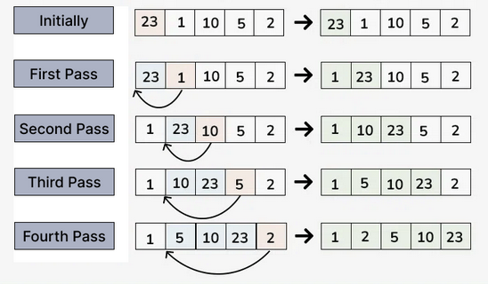
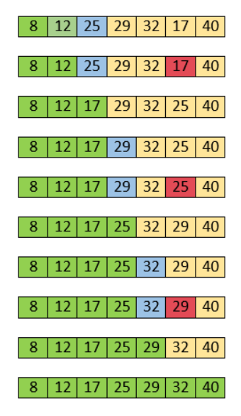

### 1. **Пузырьковая сортировка (Bubble Sort)**

**Принцип**: Пузырьковая сортировка работает путем многократного прохода по списку, где соседние элементы сравниваются, и если они идут в неправильном порядке (например, если левый элемент больше правого), то они меняются местами. Каждый проход "выталкивает" наибольший элемент в конец массива, как пузырек, поднимающийся на поверхность воды.


**Алгоритм**:
1. Итерируем по массиву, сравнивая каждую пару соседних элементов.
2. Если элемент слева больше, чем элемент справа, меняем их местами.
3. Повторяем процесс до тех пор, пока весь массив не окажется отсортированным.

**Код:**

```python
def bubble_sort(arr):
    n = len(arr)
    # Проходим по всем элементам массива
    for i in range(n):
        # Флаг, чтобы определить, были ли обмены
        swapped = False
        # Проходим по массиву, игнорируя уже отсортированные элементы
        for j in range(0, n-i-1):
            if arr[j] > arr[j+1]:  # Сравниваем два соседних элемента
                arr[j], arr[j+1] = arr[j+1], arr[j]  # Меняем их местами
                swapped = True
        # Если не было обменов, массив уже отсортирован
        if not swapped:
            break
    return arr

# Пример использования
arr = [64, 34, 25, 12, 22, 11, 90]
sorted_arr = bubble_sort(arr)
print("Отсортированный массив:", sorted_arr)
```

**Пояснение**:
- Внешний цикл идет по всем элементам.
- Внутренний цикл сравнивает соседние элементы и меняет их местами.
- Если за один проход не было сделано ни одного обмена, это означает, что массив уже отсортирован, и можно завершить сортировку раньше.

**Время выполнения**:
- В худшем и среднем случае: O(n²).
- В лучшем случае (когда массив уже отсортирован): O(n) с использованием флага `swapped`.

---

### 2. **Сортировка вставками (Insertion Sort)**

**Принцип**: Этот алгоритм сортирует элементы, проходя по массиву один за другим. Каждый новый элемент вставляется на нужное место среди уже отсортированных элементов. Этот процесс напоминает вставку карты в колоде, где карта вставляется в соответствующее место среди уже отсортированных карт.




**Алгоритм**:
1. Берем первый элемент как отсортированную часть.
2. Проходим по остальным элементам и вставляем их в отсортированную часть в нужную позицию.
3. Повторяем процесс, пока весь массив не станет отсортированным.

**Код:**

```python
def insertion_sort(arr):
    for i in range(1, len(arr)):
        key = arr[i]  # Текущий элемент для вставки
        j = i - 1
        # Сдвигаем элементы массива, которые больше текущего, вправо
        while j >= 0 and arr[j] > key:
            arr[j + 1] = arr[j]
            j -= 1
        # Вставляем текущий элемент на его место
        arr[j + 1] = key
    return arr

# Пример использования
arr = [64, 34, 25, 12, 22, 11, 90]
sorted_arr = insertion_sort(arr)
print("Отсортированный массив:", sorted_arr)
```

**Пояснение**:
- Внешний цикл итерирует по массиву, начиная с второго элемента.
- Внутренний цикл сдвигает все элементы, которые больше текущего элемента, на одну позицию вправо.
- Когда находит нужную позицию, текущий элемент вставляется в нее.

**Время выполнения**:
- В худшем и среднем случае: O(n²).
- В лучшем случае (когда данные уже отсортированы): O(n).

---

### 3. **Сортировка выбором (Selection Sort)**

**Принцип**: Алгоритм находит минимальный элемент в неотсортированной части массива и меняет его местами с первым элементом неотсортированной части. Этот процесс повторяется, пока весь массив не станет отсортированным.




**Алгоритм**:
1. Ищем минимальный элемент в неотсортированной части массива.
2. Меняем его местами с первым элементом этой части.
3. Повторяем процесс для оставшейся неотсортированной части.

**Код:**

```python
def selection_sort(arr):
    n = len(arr)
    for i in range(n):
        # Находим минимальный элемент в неотсортированной части массива
        min_idx = i
        for j in range(i+1, n):
            if arr[j] < arr[min_idx]:
                min_idx = j
        # Меняем местами минимальный элемент с первым элементом неотсортированной части
        arr[i], arr[min_idx] = arr[min_idx], arr[i]
    return arr

# Пример использования
arr = [64, 34, 25, 12, 22, 11, 90]
sorted_arr = selection_sort(arr)
print("Отсортированный массив:", sorted_arr)
```

**Пояснение**:
- Внешний цикл итерирует по массиву, находит минимальный элемент среди оставшихся неотсортированных элементов.
- После нахождения минимального элемента меняем его местами с текущим элементом.

**Время выполнения**:
- В худшем и среднем случае: O(n²).
- В лучшем случае: O(n²), так как не происходит оптимизации.

---

Конечно! Вот список из 10 задач для каждого алгоритма сортировки, которые помогут вам потренироваться в их применении и лучше понять их работу.

---

### **Задачи для тренировки алгоритма пузырьковой сортировки (Bubble Sort)**

1. **Задача 1: Отсортировать массив чисел по возрастанию.**
   - Входные данные: массив целых чисел `[64, 34, 25, 12, 22, 11, 90]`.
   - Выходные данные: отсортированный массив `[11, 12, 22, 25, 34, 64, 90]`.

2. **Задача 2: Отсортировать массив чисел по убыванию.**
   - Входные данные: массив целых чисел `[5, 3, 8, 4, 2]`.
   - Выходные данные: отсортированный массив `[8, 5, 4, 3, 2]`.

3. **Задача 3: Сортировать массив строк по алфавиту.**
   - Входные данные: список строк `["banana", "apple", "grape", "cherry", "date"]`.
   - Выходные данные: отсортированный список `["apple", "banana", "cherry", "date", "grape"]`.

4. **Задача 4: Отсортировать массив с повторяющимися элементами.**
   - Входные данные: массив целых чисел `[7, 3, 5, 3, 7, 5, 8, 2]`.
   - Выходные данные: отсортированный массив `[2, 3, 3, 5, 5, 7, 7, 8]`.

5. **Задача 5: Отсортировать массив с отрицательными числами.**
   - Входные данные: массив `[-2, 5, 0, -1, 3, -4]`.
   - Выходные данные: отсортированный массив `[-4, -2, -1, 0, 3, 5]`.

6. **Задача 6: Отсортировать массив строк по длине строк.**
   - Входные данные: список строк `["apple", "banana", "kiwi", "grape", "fig"]`.
   - Выходные данные: отсортированный список по длине строк `["fig", "kiwi", "apple", "grape", "banana"]`.

7. **Задача 7: Отсортировать массив из случайных чисел от 1 до 100.**
    Создать случайные числа при помощи библиотеки `random`.
   - Входные данные: массив случайных чисел, например, `[23, 45, 12, 67, 89, 1, 34]`.
   - Выходные данные: отсортированный массив по возрастанию.

8. **Задача 8: Сортировать список дат по возрастанию.**
   - Входные данные: список дат `["2024-12-01", "2024-01-01", "2024-06-01"]`.
   - Выходные данные: отсортированный список по возрастанию дат `["2024-01-01", "2024-06-01", "2024-12-01"]`.

9. **Задача 9: Сортировка массива с числами с плавающей точкой.**
   - Входные данные: массив с числами с плавающей запятой `[2.5, 1.2, 3.7, 0.8]`.
   - Выходные данные: отсортированный массив `[0.8, 1.2, 2.5, 3.7]`.

---

### **Задачи для тренировки алгоритма сортировки вставками (Insertion Sort)**

1. **Задача 1: Отсортировать массив чисел по возрастанию.**
   - Входные данные: массив `[45, 12, 78, 34, 23, 56]`.
   - Выходные данные: отсортированный массив `[12, 23, 34, 45, 56, 78]`.

2. **Задача 2: Отсортировать массив строк по алфавиту.**
   - Входные данные: массив строк `["pear", "apple", "orange", "banana", "grape"]`.
   - Выходные данные: отсортированный массив `["apple", "banana", "grape", "orange", "pear"]`.

3. **Задача 3: Сортировать массив целых чисел с отрицательными значениями.**
   - Входные данные: массив `[-5, -2, -1, -9, 0, -3]`.
   - Выходные данные: отсортированный массив `[-9, -5, -3, -2, -1, 0]`.

4. **Задача 4: Отсортировать массив чисел с плавающей запятой.**
   - Входные данные: массив `[12.1, 3.4, 7.8, 0.9]`.
   - Выходные данные: отсортированный массив `[0.9, 3.4, 7.8, 12.1]`.

5. **Задача 5: Отсортировать список дат по возрастанию.**
   - Входные данные: список дат `["2024-05-01", "2023-12-15", "2024-01-25", "2024-03-10"]`.
   - Выходные данные: отсортированный список дат `["2023-12-15", "2024-01-25", "2024-03-10", "2024-05-01"]`.

6. **Задача 6: Сортировать массив строк по длине.**
   - Входные данные: список строк `["cat", "elephant", "dog", "mouse", "rat"]`.
   - Выходные данные: отсортированный список по длине строк `["cat", "dog", "rat", "mouse", "elephant"]`.

7. **Задача 7: Отсортировать массив с числами, имеющими одинаковую разницу.**
   - Входные данные: массив `[10, 5, 0, 15, 20]`.
   - Выходные данные: отсортированный массив `[0, 5, 10, 15, 20]`.

8. **Задача 8: Сортировать список чисел с повторяющимися элементами.**
   - Входные данные: массив `[3, 1, 4, 4, 2, 2, 5]`.
   - Выходные данные: отсортированный массив `[1, 2, 2, 3, 4, 4, 5]`.

9. **Задача 9: Отсортировать массив чисел по убыванию.**
   - Входные данные: массив `[9, 4, 7, 3, 6, 1]`.
   - Выходные данные: отсортированный массив `[9, 7, 6, 4, 3, 1]`.

---

### **Задачи для тренировки алгоритма сортировки выбором (Selection Sort)**

1. **Задача 1: Отсортировать массив целых чисел по возрастанию.**
   - Входные данные: массив `[22, 11, 99, 33, 55, 44]`.
   - Выходные данные: отсортированный массив `[11, 22, 33, 44, 55, 99]`.

2. **Задача 2: Сортировать массив строк по алфавиту.**
   - Входные данные: список строк `["zebra", "apple", "orange", "banana"]`.
   - Выходные данные: отсортированный список `["apple", "banana", "orange", "zebra"]`.

3. **Задача 3: Отсортировать массив с отрицательными числами.**
   - Входные данные: массив `[-5, -2, -3, -9, -1]`.
   - Выходные данные: отсортированный массив `[-9, -5, -3, -2, -1]`.

4. **Задача 4: Отсортировать массив чисел по убыванию.**
   - Входные данные: массив `[1, 4, 2, 8, 5, 7]`.
   - Выходные данные: отсортированный массив `[8, 7, 5, 4, 2, 1]`.

5. **Задача 5: Отсортировать массив строк по длине.**
   - Входные данные: список строк `["cat", "elephant", "dog", "bat"]`.
   - Выходные данные: отсортированный список по длине строк `["cat", "dog", "bat", "elephant"]`.

6. **Задача 6: Сортировать массив чисел с плавающей запятой.**
   - Входные данные: массив `[12.1, 3.4, 7.8, 0.9]`.
   - Выходные данные: отсортированный массив `[0.9, 3.4, 7.8, 12.1]`.

7. **Задача 7: Отсортировать массив с повторяющимися элементами.**
   - Входные данные: массив `[3, 1, 2, 2, 1]`.
   - Выходные данные: отсортированный массив `[1, 1, 2, 2, 3]`.

8. **Задача 8: Сортировать массив из случайных чисел от 1 до 100.**
   - Входные данные: массив случайных чисел.
   - Выходные данные: отсортированный массив.

9. **Задача 9: Сортировать массив дат.**
   - Входные данные: список дат `["2024-05-01", "2023-12-15", "2024-01-25"]`.
   - Выходные данные: отсортированный список дат `["2023-12-15", "2024-01-25", "2024-05-01"]`.
