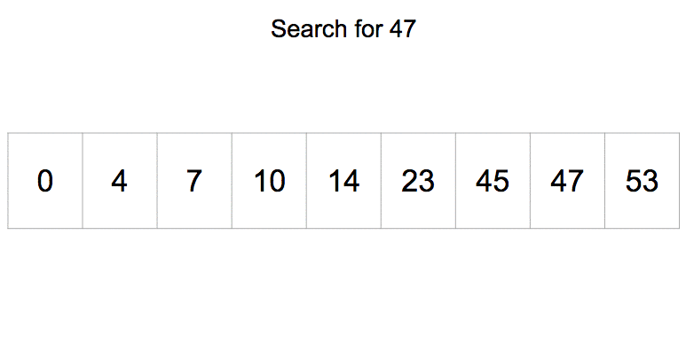

# Занятие 1: Алгоритмы поиска

Поиск — это одна из самых фундаментальных задач в программировании, связанная с нахождением нужного элемента в наборе данных (например, в массиве, списке или графе). Существует множество различных алгоритмов поиска, которые отличаются по эффективности в зависимости от структуры данных, в которой осуществляется поиск.

---

### 1. **Линейный поиск (Linear Search)**

#### Описание:
Линейный поиск — это простейший алгоритм поиска. Он проверяет каждый элемент коллекции, начиная с первого, и сравнивает его с искомым. Если элемент найден, возвращается его индекс. Если элемент не найден, алгоритм проходит через все элементы и возвращает значение, указывающее на отсутствие искомого.

#### Характеристики:
- **Массив**: Может работать с любыми массивами или списками (сортированными или не сортированными).
- **Время работы**: В худшем случае — O(n), где n — количество элементов в коллекции.
- **Простота реализации**: Алгоритм очень прост в реализации.
- **Преимущества**:
  - Работает с неотсортированными данными.
  - Легко понять и реализовать.
  
#### Пример:
```python
def linear_search(arr, target):
    for i in range(len(arr)):
        if arr[i] == target:
            return i  # Индекс найденного элемента
    return -1  # Если элемент не найден
```

---

### 2. **Бинарный поиск (Binary Search)**

#### Описание:
Бинарный поиск — это эффективный алгоритм поиска в отсортированных массивах. Алгоритм делит массив пополам и проверяет центральный элемент. Если центральный элемент равен искомому, то поиск завершен. Если центральный элемент больше искомого, поиск продолжается в левой половине массива, если меньше — в правой половине.  
  

#### Характеристики:
- **Массив**: Требует отсортированного массива.
- **Время работы**: O(log n), где n — количество элементов в коллекции.
- **Простота реализации**: Реализация более сложная, чем у линейного поиска, но она значительно быстрее.
- **Преимущества**:
  - Очень быстрое выполнение на больших объемах данных, если массив отсортирован.
  - Меньшее количество сравнений по сравнению с линейным поиском.
  
#### Пример:
```python
def binary_search(arr, target):
    low, high = 0, len(arr) - 1
    while low <= high:
        mid = (low + high) // 2
        if arr[mid] == target:
            return mid  # Индекс найденного элемента
        elif arr[mid] < target:
            low = mid + 1
        else:
            high = mid - 1
    return -1  # Если элемент не найден
```


### **Задачи для линейного поиска**

#### **Задача 1: Поиск элемента в списке**
**Условие:**
Напишите функцию, которая принимает на вход список целых чисел и число, которое нужно найти в этом списке. Если элемент найден, функция должна вернуть его индекс, если нет — вернуть `-1`.

**Пример:**
```python
input: [10, 20, 30, 40, 50], 30
output: 2

input: [10, 20, 30, 40, 50], 60
output: -1
```

#### **Задача 2: Подсчет количества вхождений элемента**
**Условие:**
Напишите функцию, которая принимает список целых чисел и число. Функция должна вернуть количество вхождений этого числа в список.

**Пример:**
```python
input: [1, 2, 3, 1, 4, 1], 1
output: 3

input: [5, 6, 7, 8, 9], 3
output: 0
```

#### **Задача 3: Проверка наличия дубликатов**
**Условие:**
Напишите функцию, которая принимает список чисел и возвращает `True`, если в списке есть хотя бы два одинаковых числа, и `False`, если все числа уникальны. Используйте линейный поиск для проверки каждой пары элементов.

**Пример:**
```python
input: [1, 2, 3, 4, 5]
output: False

input: [1, 2, 3, 4, 1]
output: True
```

---

### **Задачи для бинарного поиска**

#### **Задача 1: Бинарный поиск в отсортированном списке**
**Условие:**
Напишите функцию, которая принимает отсортированный список целых чисел и число, которое нужно найти. Функция должна вернуть индекс числа, если оно есть в списке, или `-1`, если число не найдено.

**Пример:**
```python
input: [1, 3, 5, 7, 9], 5
output: 2

input: [1, 3, 5, 7, 9], 6
output: -1
```

#### **Задача 2: Нахождение ближайшего числа к заданному в отсортированном массиве**

**Условие:**
Дан отсортированный массив целых чисел и число target. Напишите функцию, которая находит ближайшее к target число в массиве. Если таких чисел несколько, верните наименьший индекс.

Пример:
```python
input: [1, 2, 3, 5, 6], 4
output: 3  # Ближайшее число к 4 — это 3 (индекс 3)

input: [1, 2, 3, 5, 6], 0
output: 1  # Ближайшее число к 0 — это 1 (индекс 0)
```

#### **Задача 3: Бинарный поиск для вставки элемента**
**Условие:**
Напишите функцию, которая находит индекс, на котором нужно вставить элемент в отсортированный список, чтобы сохранить порядок сортировки. Функция должна вернуть индекс первой позиции, где элемент может быть вставлен, чтобы список оставался отсортированным.

**Пример:**
```python
input: [1, 3, 5, 7], 4
output: 2

input: [1, 2, 3, 5, 6], 4
output: 3
```

---

### **Дополнительные задачи**

#### **Задача 1: Сумма двух чисел**
**Условие:**
Дан отсортированный список целых чисел и число `target`. Напишите функцию, которая находит два индекса в массиве, сумма которых равна `target`. Используйте бинарный поиск для улучшения производительности.

**Пример:**
```python
input: [1, 2, 3, 4, 6], target=5
output: (0, 3)  # Индексы чисел 1 и 4

input: [1, 2, 3, 4, 6], target=10
output: None  # Сумма не существует
```

#### **Задача 2: Нахождение первого вхождения элемента**
**Условие:**
Напишите функцию, которая принимает отсортированный список целых чисел и число, которое нужно найти. Если число встречается в списке несколько раз, функция должна вернуть индекс первого вхождения этого числа. Если числа нет в списке, вернуть `-1`.

**Пример:**
```python
input: [1, 2, 2, 2, 3, 4], 2
output: 1

input: [1, 2, 3, 4, 5], 6
output: -1
```